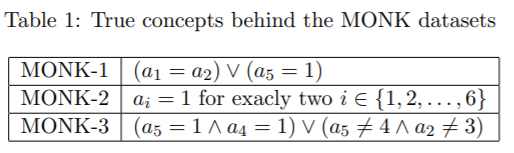
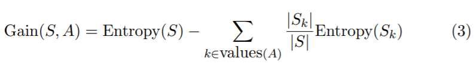
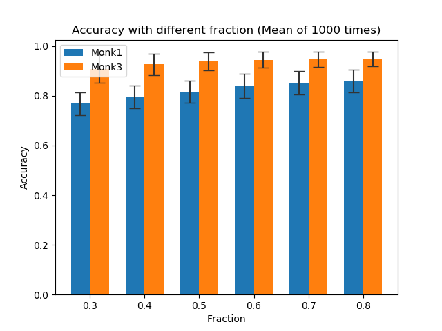

# Lab1 - Decision Trees

### Assignment 0: 
> Each one of the datasets has properties which makes them hard to learn. Motivate which of the three problems is most difficult for a decision tree algorithm to learn.




Monk-1:
The difficulty of Monk1 is to seperate the effect of a1 and a2 attributes because the concept of decision tree is to calculate accuracy by different attribute.

Monk-2:
The difficulty of Monk2 is all the attirbutes are dependency.

Monk-3:
The difficulty of Mock3 is to seperate the effect bewteen a5 and a6 and bewteen a5 and a2. Also it has 5% additional noise (misclassification) in the training set.

### Assignment 1: 
> The file `dtree.py` defines a function entropy which calculates the entropy of a dataset. Import this file along with the monks datasets and use it to calculate the entropy of the training datasets.
        
|       | entropy  |
| ----- | -------- |
| Monk1 | 1.000000 |
| Monk2 | 0.957117 |
| Monk3 | 0.999806 |

### Assignment 2: 
> Explain entropy for a uniform distribution and a non-uniform distribution, present some example distributions with high and low entropy.

Rolling a fair die. 
There are six surfaces. Each surface is rolled to the same probability. The entropy of the fair die is $6 \times (-\dfrac{1}{6}log_2(\dfrac{1}{6})) \approx 2.58$

Tossing a fair coin.
There are two surfaces. The entropy of the fair  die is $2 \times (-\dfrac{1}{2}log_2(\dfrac{1}{2})) = 1$

Both the example are normal, but the entropy is different. We know that the larger entropy will be more difficult to select the correct anwser. Because the die has six surfaces, if ramdonly choose one surface, it is more possible to choose the wrong one than the coin.

### Assignment 3: 
> Use the function `averageGain` (defined in `dtree.py`) to calculate the expected information gain corresponding to each of the six attributes. Note that the attributes are represented as instances of the `class Attribute` (defined in `monkdata.py`) which you can access via `m.attributes[0]`, ..., `m.attributes[5]`. Based on the results, which attribute should be used for splitting the examples at the root node?

<b>Information Gain</b>

|     | A1 | A2 | A3 | A4 | A5 | A6 |
|-----|----|----|----|----|----|----|
|Monk1|0.075273|0.005838|0.004708|0.026312|**0.287031**|0.000758|
|Monk2|0.003756|0.002458|0.001056|0.015664|**0.017277**|0.006248|
|Monk3|0.007121|**0.293736**|0.000831|0.002892|0.255912|0.007077|

Used attribute:
<p>Monk1 - A5</p>
<p>Monk2 - A5</p>
<p>Monk3 - A2</p>

### Assignment 4:
> For splitting we choose the attribute that maximizes the information gain, Eq.3. Looking at Eq.3 how does the entropy of the subsets, $S_k$, look like when the information gain is maximized?
How can we motivate using the information gain as a heuristic for picking an attribute for splitting? Think about reduction in entropy after the split and what the entropy implies.


Choose the maximization of information gain, so the entropy will be minimized.
Because if we are more certainty to select the answner, the more information we obtain.

<b>Entropy</b>

|          | 1      | 2      | 3      | 4      |
|----------|--------|--------|--------|--------|
|Monk1 - A5|0.000000|0.938315|0.948078|0.908178|
|Monk2 - A5|0.910348|1.000000|0.963336|0.877962|

|          | 1      | 2      | 3      |
|----------|--------|--------|--------|
|Monk3 - A2|0.918296|0.829607|0.377646|


### Assignment 5:
> Build the full decision trees for all three Monk datasets using buildTree. Then, use the function check to measure the performance of the decision tree on both the training and test datasets.
For example to built a tree for monk1 and compute the performance
on the test data you could use
```python
import monkdata as m
import dtree as d
t = d.buildTree(m.monk1, m.attributes)
print(d.check(t, m.monk1test))
```
> Compute the train and test set errors for the three Monk datasets for the full trees. Were your assumptions about the datasets correct?
Explain the results you get for the training and test datasets.

<b>Accuracy</b>

|     | Train | Test     |
|-----|-------|----------|
|Monk1| 1.0   | 0.828704 |
|Monk2| 1.0   | 0.692130 |
|Monk3| 1.0   | 0.944444 |

This is the accuracy of building full tree, so the tree will more fit (overfitting) to the training set than testing set. Also, the monk2 has the worst result because the true concept of monk2 shows that it is more difficult to seperate the data by only one attribute.

### Assignment 6:
> Explain pruning from a bias variance trade-off perspective.

The full tree has high variance and low bias.
It will be built in more detailed by the given data, if the input data are changed, the tree will be defferent.
The pruning tree has low variance and high bias.
It might be build in less depth and each leaf has more data, so it will has high bias. But if the input data are changed, the tree might be the same, so it has low variance.

### Assignment 7: 
> Evaluate the effect pruning has on the test error for the monk1 and monk3 datasets, in particular determine the optimal partition into training and pruning by optimizing the parameter `fraction`. Plot the classification error on the test sets as a function of the parameter `fraction` ∈ {0.3, 0.4, 0.5, 0.6, 0.7, 0.8}.
Note that the split of the data is random. We therefore need to
compute the statistics over several runs of the split to be able to draw
any conclusions. Reasonable statistics includes mean and a measure
of the spread. Do remember to print axes labels, legends and data
points as you will not pass without them.


<p>When the fraction is large, the accuracy is higher.</p>