# Lab2 - Support Vector Machines

### Assignment 1: 

> Move the clusters around and change their sizes to make it easier or harder for the classifier to find a decent boundary. Pay attention to when the optimizer (minimize function) is not able to find a solution at all.

**Easier**

``` python
classA = np.random.randn(10, 2) * 0.5 + [1.5, 0.5]
classB = np.random.randn(20, 2) * 0.2 + [0.0, -0.5]
```
<div align="center">
    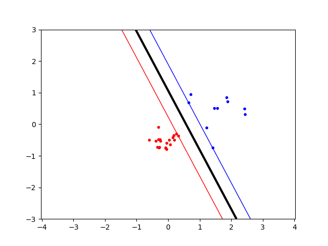
</div>

**Harder**

``` python
classA = np.concatenate((np.random.randn(10, 2) * 0.5 + [1.5, 0.5], 
                        np.random.randn(10, 2)  * 0.5 + [-1.5, 0.5]))
classB = np.concatenate((np.random.randn(20, 2) * 0.5 + [0.0, -0.5], 
                        np.random.randn(20, 2)  * 0.5 + [-2.0, -1.0]))
```

<div align="center">
    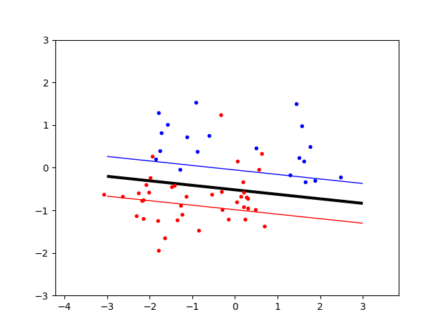
</div>

### Assignment 2: 

> Implement the two non-linear kernels. You should be able to classify very hard data sets with these.
        
In the kernel function, it has three different kernels can be choose. There are linear, polynomial and RBF kernel.

Here is an example to show the easy and hard data can be both classified by polynomial and RBF kernel.

**Easier vs. Harder data sets**

* Polynomial kernel

<table align="center">
    <tr>
        <td>
            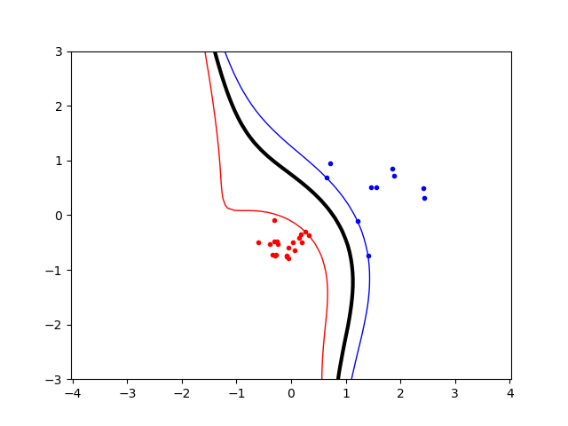
        </td>
        <td>
            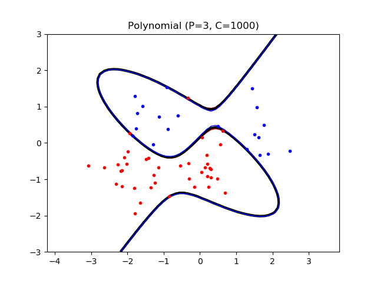
        </td>
    </tr>
</table>

* RBF kernel

<table align="center">
    <tr>
        <td>
            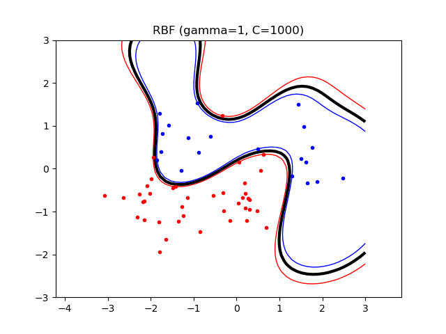
        </td>
        <td>
            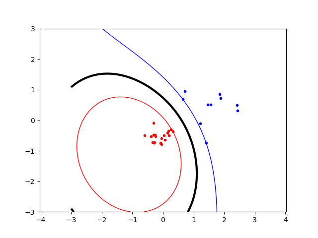
        </td>
    </tr>
</table>

### Assignment 3: 

> The non-linear kernels have parameters; explore how they influence the decision boundary. Reason about this in terms of the bias variance trade-off.

**Polynomial kernel**

The exponent p (a positive integer) controls the degree of the polynomials.

<table align="center">
    <tr>
        <td>
            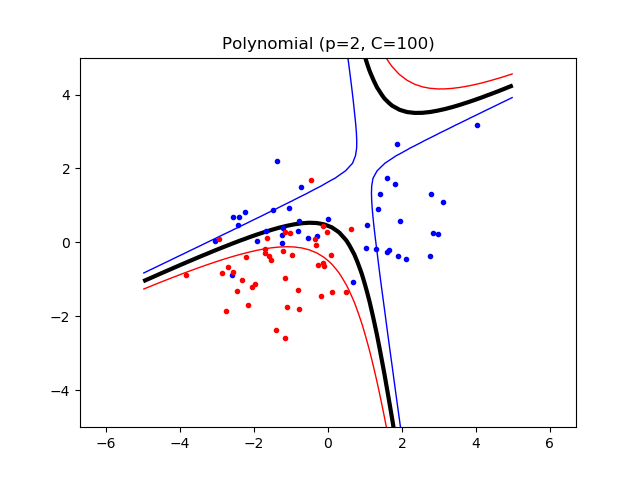
        </td>
        <td>
            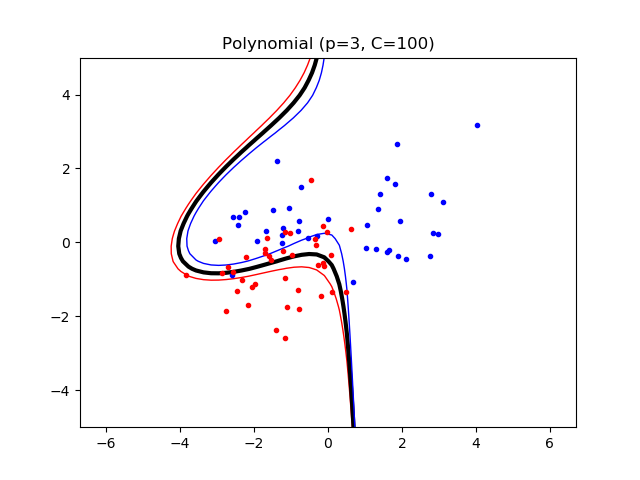
        </td>
        <td>
            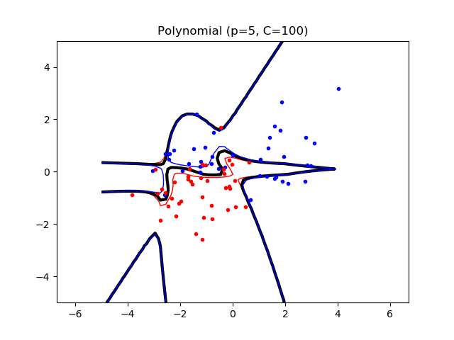
        </td>
    </tr>
</table>

**RBF kernel**

The parameter σ is used to
control the smoothness of the boundary.

<table align="center">
    <tr>
        <td>
            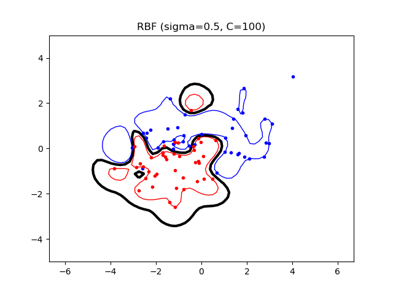
        </td>
        <td>
            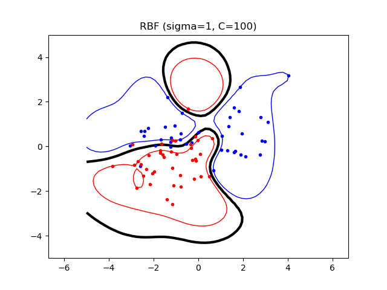
        </td>
        <td>
            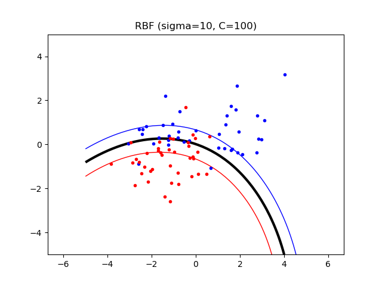
        </td>
    </tr>
</table>

### Assignment 4: 

> Explore the role of the slack parameter C. What happens for very large/small values?

Noisy data need a low C value, allowing for more slack, since individual datapoints in strange locations should not be taken too seriously.

Below is the result of C = 1, 10 and 1000 in different kernel.

**Linear kernel**

<table align="center">
    <tr>
        <td>
            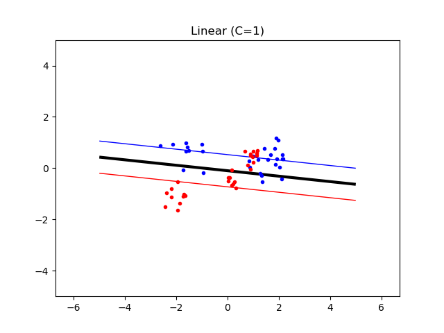
        </td>
        <td>
            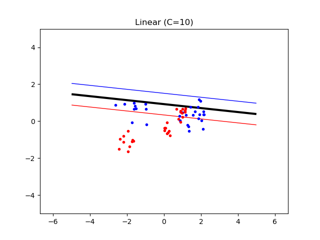
        </td>
        <td>
            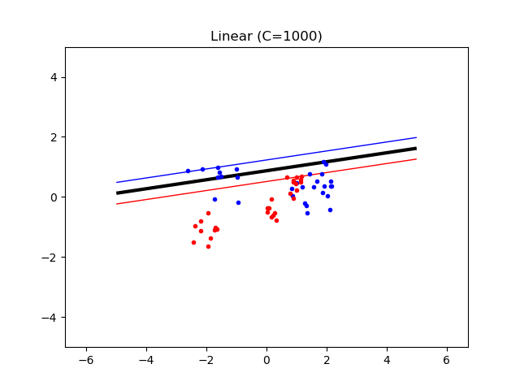
        </td>
    </tr>
</table>

**Polynomial kernel**

<table align="center">
    <tr>
        <td>
            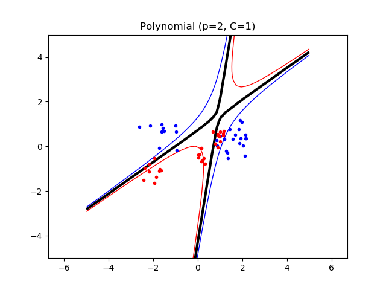
        </td>
        <td>
            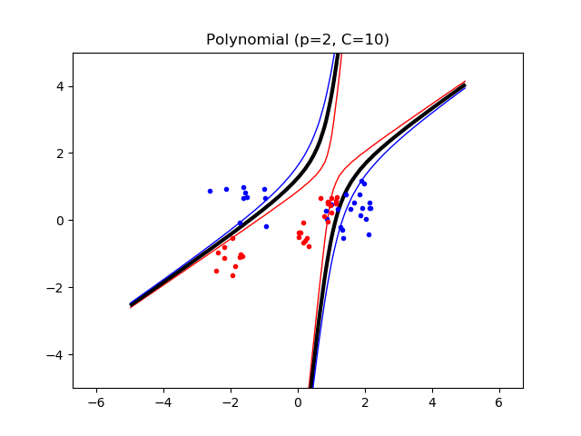
        </td>
        <td>
            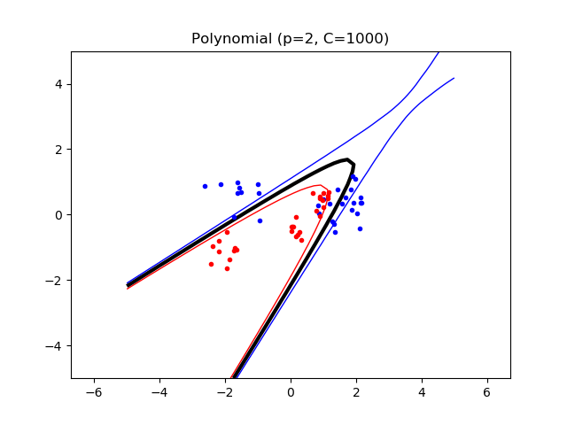
        </td>
    </tr>
</table>

**RBF kernel**

<table align="center">
    <tr>
        <td>
            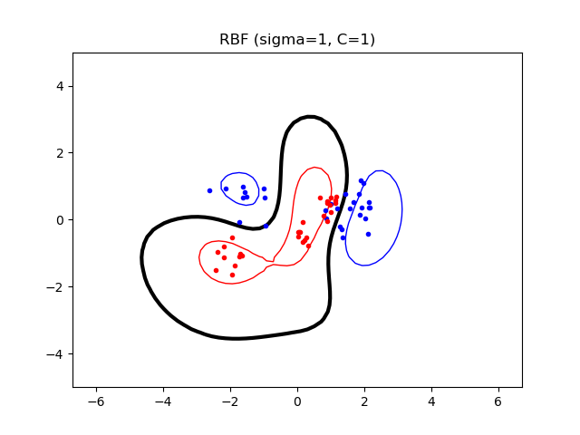
        </td>
        <td>
            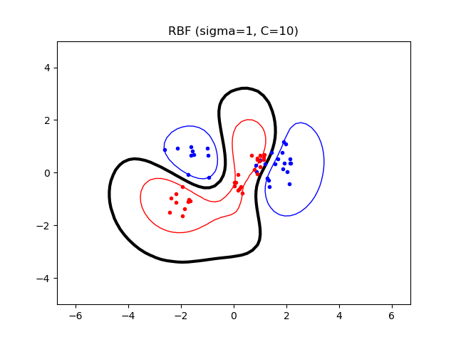
        </td>
        <td>
            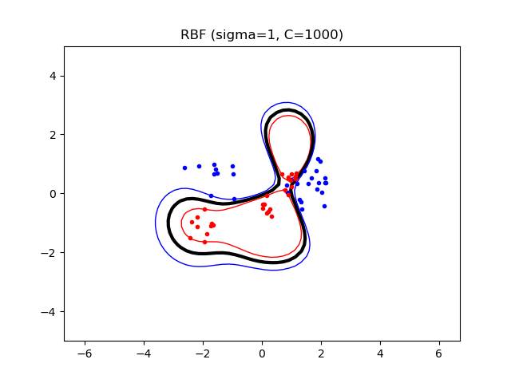
        </td>
    </tr>
</table>

### Assignment 5:

> Imagine that you are given data that is not easily separable. When should you opt for more slack rather than going for a more complex model (kernel) and vice versa?

If using more complex model, it means that model is fix good in that given data. But it is pobrably become overfit in that given data. Sometimes the data itself has noise, so using the boundary to allow a few datapoints to be miss-classified is better than fit all the data.
However, if the data does not have too much noisy data, it might be better to use more complex model to fit the data points because it is might be the data itself is complex.