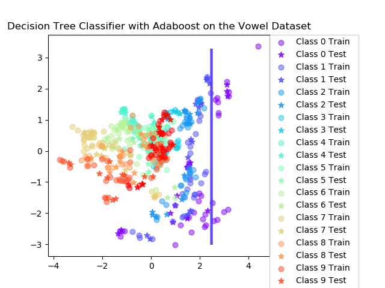

# Lab3 - Bayesian Learning and Boosting

### µk and Σk

Using the ML-estimates (Maximum Likelihood) for the Gaussian distributed data with 95%-confidence interval.

    

###  Naive Bayes Classifier on the Iris Dataset

<table align="center">
    <tr>
        <td>
            
        </td>
        <td>
            
        </td>
    </tr>
</table>

### Decision Tree Classifier on the Iris Dataset

<table align="center">
    <tr>
        <td>
            
        </td>
        <td>
            
        </td>
    </tr>
</table>

### Naive Bayes Classifier on the Vowel Dataset

<table align="center">
    <tr>
        <td>
            
        </td>
        <td>
            
        </td>
    </tr>
</table>

### Decision Tree Classifier on the Vowel Dataset

<table align="center">
    <tr>
        <td>
            
        </td>
        <td>
            
        </td>
    </tr>
</table>

> When can a feature independence assumption be reasonable and when not?

> How does the decision boundary look for the Iris dataset? How could one improve the classification results for this scenario by changing classifier or, alternatively, manipulating the data?

> Compute the classification accuracy of the boosted classifier on some data sets and compare it with those of the basic classifier on the vowels and iris data sets:

1. Is there any improvement in classification accuracy? Why/why not?

    Bayes classifier:

    Decision tree classifier:

2. Plot the decision boundary of the boosted classifier on iris and compare it with that of the basic. What differences do you notice? Is the boundary of the boosted version more complex?

    Bayes classifier:

    Decision tree classifier:

3. Can we make up for not using a more advanced model in the basic classifier (e.g. independent features) by using boosting?

    Bayes classifier:

    Decision tree classifier:

> If you had to pick a classifier, naive Bayes or a decision tree or the boosted versions of these, which one would you pick? Motivate from the following criteria:

• Outliers

• Irrelevant inputs: part of the feature space is irrelevant

• Predictive power

• Mixed types of data: binary, categorical or continuous features, etc.

• Scalability: the dimension of the data, D, is large or the number of instances, N, is large, or both.