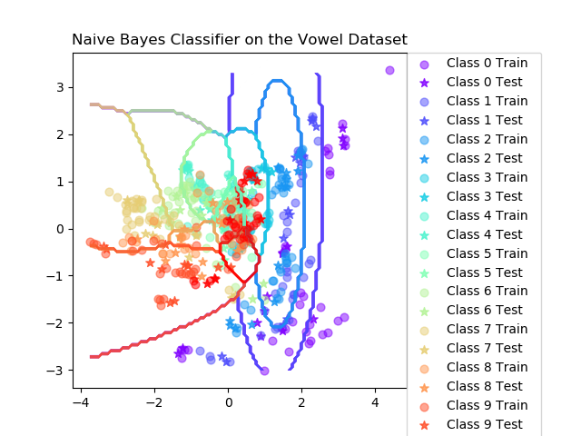
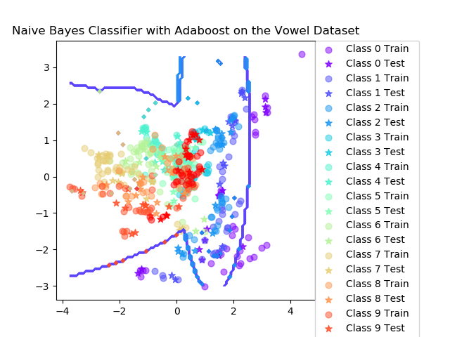
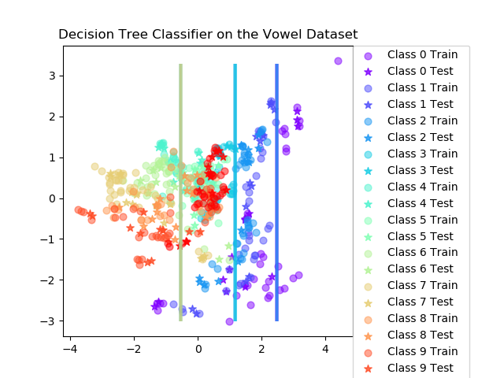

# Lab3 - Bayesian Learning and Boosting

### µk and Σk

Naive bayes classifier using the ML-estimates (Maximum Likelihood) for the Gaussian distributed data with 95%-confidence interval.

For simplicity, assume all of the feature dimensions are uncorrelated, so the covariance matrix is diagonal.

    

###  Naive Bayes Classifier on the Iris Dataset

<table align="center">
    <tr>
        <td>
            
        </td>
        <td>
            
        </td>
    </tr>
</table>

> When can a feature independence assumption be reasonable and when not?

Bayes classifiers assume that all of the feature are independent, so it is easier to calculate and generate the general formula for computing. Also, the performance is good. But if the data points are very messy and correlated, then still using feature independence will become unreasonable.

> How does the decision boundary look for the Iris dataset without boosting? How could one improve the classification results for this scenario by changing classifier or, alternatively, manipulating the data?

The left boundary looks good to separate class 0 will others. Since class 1 and 2 are more noisy and overlap, the right boundary looks bad to separate. Using a more complex model, like SVM, it might be better. Or if the data points can be chose which data points could be training data points, it can avoid choosing the points of class 1 close to the points of class 2.

### Decision Tree Classifier on the Iris Dataset

<table align="center">
    <tr>
        <td>
            
        </td>
        <td>
            
        </td>
    </tr>
</table>

### Naive Bayes Classifier on the Vowel Dataset

<table align="center">
    <tr>
        <td>
            
        </td>
        <td>
            
        </td>
    </tr>
</table>

### Decision Tree Classifier on the Vowel Dataset

<table align="center">
    <tr>
        <td>
            
        </td>
        <td>
            
        </td>
    </tr>
</table>

### Observe
> Compute the classification accuracy of the boosted classifier on some data sets and compare it with those of the basic classifier on the vowels and iris data sets:

1. Is there any improvement in classification accuracy? Why/why not?

    Yes, in both the iris and vowel datasets and both bayes classifier and desicion tree classifier, the accuracy is higher than the basic classifier. That is because the boosting is to add weight to the misclassified data points, the misclassified data points will get more attention in the next iteration.

    **Bayes classifier**

    Final mean classification in iris dataset and vowel dataset:
    <table align="center">
        <tr>
            <th>Iris Dataset</th>
            <th>Vowel Dataset</th>
        </tr>
        <tr>
            <td>
                <table align="center">
                    <tr>
                        <th>Classifier</th>
                        <th>Accuracy</th>
                        <th>Standard Deviation</th>
                    </tr>
                    <tr>
                        <td>basic classifier</td>
                        <td>89</td>
                        <td>4.16</td>
                    </tr>
                    <tr>
                        <td>boosted classifier</td>
                        <td>94.1</td>
                        <td>6.72</td>
                    </tr>
                </table>
            </td>
            <td>
                <table align="center">
                    <tr>
                        <th>Classifier</th>
                        <th>Accuracy</th>
                        <th>Standard Deviation</th>
                    </tr>
                    <tr>
                        <td>basic classifier</td>
                        <td>64.7</td>
                        <td>4.03</td>
                    </tr>
                    <tr>
                        <td>boosted classifier</td>
                        <td>80.2</td>
                        <td>3.52</td>
                    </tr>
                </table>
            </td>
        </tr>
    </table>

    **Decision tree classifier**

    Final mean classification in iris dataset and vowel dataset:
    <table align="center">
        <tr>
            <th>Iris Dataset</th>
            <th>Vowel Dataset</th>
        </tr>
        <tr>
            <td>
                <table align="center">
                    <tr>
                        <th>Classifier</th>
                        <th>Accuracy</th>
                        <th>Standard Deviation</th>
                    </tr>
                    <tr>
                        <td>basic classifier</td>
                        <td>92.4</td>
                        <td>3.71</td>
                    </tr>
                    <tr>
                        <td>boosted classifier</td>
                        <td>94.6</td>
                        <td>3.65</td>
                    </tr>
                </table>
            </td>
            <td>
                <table align="center">
                    <tr>
                        <th>Classifier</th>
                        <th>Accuracy</th>
                        <th>Standard Deviation</th>
                    </tr>
                    <tr>
                        <td>basic classifier</td>
                        <td>64.1</td>
                        <td>4</td>
                    </tr>
                    <tr>
                        <td>boosted classifier</td>
                        <td>86.7</td>
                        <td>2.96</td>
                    </tr>
                </table>
            </td>
        </tr>
    </table>

2. Plot the decision boundary of the boosted classifier on iris and compare it with that of the basic. What differences do you notice? Is the boundary of the boosted version more complex?

    The right boundary in the boosted classifier is more complex and separate the data points better than the basic classifier in both Bayes classifier and Decision Tree classifier. (See the above figure)

3. Can we make up for not using a more advanced model in the basic classifier (e.g. independent features) by using boosting?

    Yes, the accuracy could be increased by using boosting in both Bayes classifier and decision tree classifier.

> If you had to pick a classifier, naive Bayes or a decision tree or the boosted versions of these, which one would you pick? Motivate from the following criteria:

1. Outliers

    Naive Bayes without boosted version. Because the decision tree will look into all the data points and try to fit all the situations, this might lead to overfitting in outliers. The boosted version will increase the weight in misclassified points, so the outlier will become more important and lead to overfitting.

2.  Irrelevant inputs: part of the feature space is irrelevant

    Decision Tree. Because the decision tree is to separate data points by choosing one feature at one time, it can only choose the one has higher information gain and relate to the result. However, Naive Bayes will consider all the features.

3. Predictive power

    Decision Tree with boosted version. It has the best performance in prediction. (See above result)

4. Mixed types of data: binary, categorical or continuous features, etc.

    Because the design of both classifiers is not be limited in some kinds of features, both of them can use on binary and categorical features. However, the decision tree can not choose the continuous feature since it is difficult to separate data points into different branches.

5. Scalability: the dimension of the data, D, is large or the number of instances, N, is large, or both.

    Decision Tree with boosted version. From the above experience, the desicion tree with boosted version has the best accuracy in vowel dataset (the number of instances is larger than iris dataset)